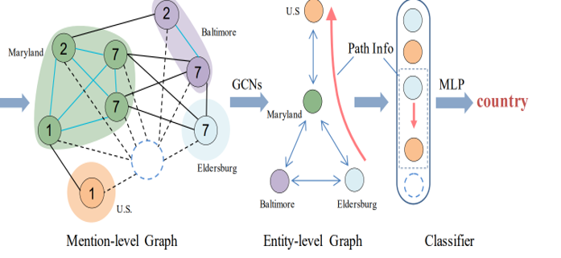

<!-- PROJECT LOGO -->

<br />
<div align="center">
  <!-- <a href="https://github.com/othneildrew/Best-README-Template">
    
  </a> -->

  <h3 align="center">Double Graph Gudied Relation Extraction Enhanced with Contexual Pool</h3>

  <p align="center">
   My model is improved through  <a href="https://aclanthology.org/2020.emnlp-main.127/"><strong>GAIN</strong></a> and <a href="https://arxiv.org/abs/2010.11304"><strong>ATLOP</strong></a>
    <br />
    <a href="https://github.com/Polarisjame/Double-Graph-Gudied-Relation-Extraction-Enhanced-with-Contexual-Pool.git"><strong>Explore the docs »</strong></a>
    <br />
  </p>
</div>

<a name="readme-top"></a>

<!-- TABLE OF CONTENTS -->

<details>
  <summary>Table of Contents</summary>
  <ol>
    <li>
      <a href="#about-the-project">About The Project</a>
    </li>
    <li>
      <a href="#getting-started">Getting Started</a>
      <ul>
        <li><a href="#requirements">Requirements</a></li>
        <li><a href="#dataset">Dataset</a></li>
        <li><a href="#dataset">PLM</a></li>
      </ul>
    </li>
    <li>
      <a href="#training-and-testing">Training</a>
      <ul>
        <li><a href="#train">Train</a></li>
      </ul>
    </li>
  </ol>
</details>

<!-- ABOUT THE PROJECT -->
## About The Project

As illustrated in figure, My model Follow the structure of GAIN.



Inspired by the paper *Document-Level Relation Extraction With Adaptive Thresholding And Localized Context Pooling*, I replaced the **mention representation** with Special Token (e.g., \***Britain**\* ‘s Prince \***Harry**\* is engaged to his US partner …, where **'\*'** represents to a special token.) instead of Average Pooling. <br>
Secondly, I use **Graph Attention Network** to capture the Strcutural Feature of Document and Reduce noise at the same time.<br>
Besides, I merge the mention representations to entity representation through **LogSumExp Pooling**, which is proved to perform better than Average Pooling.<br>
Finally, I redesign the representation of  Paths in Entity Graph. Following <a href="https://arxiv.org/abs/2010.11304">*Zhou et al.(2021)*</a>, I merge **Contextual Information** through Attention mechanism to Entity Representation to construct Path between entity pairs and do Inference on entity graph.

<p align="right">(<a href="#readme-top">back to top</a>)</p>

<!-- GETTING STARTED -->
## Getting Started

### Requirements

My code works with the following environment.

* `python=3.7`
* `pytorch=1.6.0+cu102`
* `dgl-cu102(0.4.3)`
* numpy
* pandas
* sklearn
* einops

### Dataset

+ Download data from [`DocRED`](https://drive.google.com/drive/folders/1c5-0YwnoJx8NS6CV2f-NoTHR__BdkNqw) shared by DocRED authors
+ Put train_annotated.json, dev.json, test.json, word2id.json, ner2id.json, rel2id.json, vec.npy into the directory data/

### PLM
+ download Pretrained Language Model throught [Link](http://viewsetting.xyz/2019/10/17/pytorch_transformers/?nsukey=v0sWRSl5BbNLDI3eWyUvd1HlPVJiEOiV%2Fk8adAy5VryF9JNLUt1TidZkzaDANBUG6yb6ZGywa9Qa7qiP3KssXrGXeNC1S21IyT6HZq6%2BZ71K1ADF1jKBTGkgRHaarcXIA5%2B1cUq%2BdM%2FhoJVzgDoM7lcmJg9%2Be6NarwsZzpwAbAwjHTLv5b2uQzsSrYwJEdPl7q9O70SmzCJ1VF511vwxKA%3D%3D). put possible required files (`pytorch_model.bin`, `config.json`, `vocab.txt`, etc.) into the directory `PLM/bert-????-uncased` such as `PLM/bert-base-uncased`.

<p align="right">(<a href="#readme-top">back to top</a>)</p>

<!-- Training and Testing -->
## Training

### Train

```
>> cd code
>> ./runXXX.sh gpu_id   # like ./run_GAIN_BERT.sh 2
```
results are saved under code/logs

<p align="right">(<a href="#readme-top">back to top</a>)</p>

## License

This project is licensed under the MIT License - see the [LICENSE](https://github.com/Polarisjame/Double-Graph-Gudied-Relation-Extraction-Enhanced-with-Contexual-Pool/blob/main/LICENSE) file for details.
